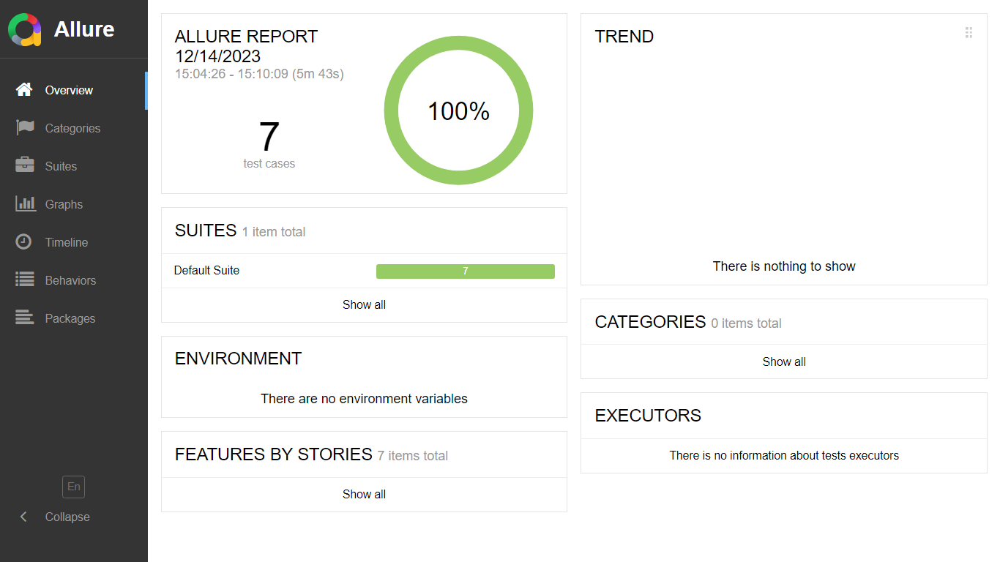
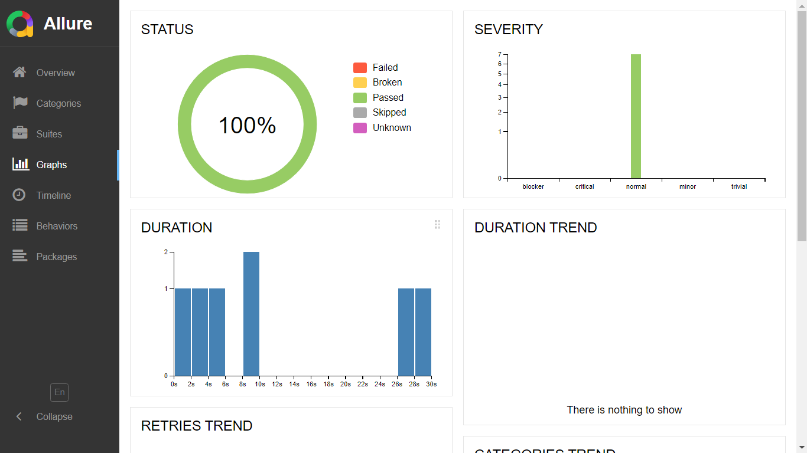

# Mobile Automation with Sauce Lab 

This repository contains code and instructions for performing mobile automation testing on saucelabs.apk.  Sauce Labs provides a cloud-based platform for automated testing of web and mobile applications.

## Table of Contents

1. [Getting Started](#getting-started)
2. [Installation](#installation)
3. [Project Structure](#project-structure)
4. [Test Scenarios](#test-scenarios)
   - [Login Test](#login-test)
   - [HomePageTest](#homepage_test)
   - [Cart-Test](#cart-test)
6. [Reports](#reports)

## Overview

This repository contains automated tests for the SauceLab mobile app. The tests cover login, product browsing, shopping cart management, and order confirmation. The test framework is built using Selenium and TestNG, and reports are generated using Allure.

## Getting Started

Follow these steps to set up and run mobile automation tests using Sauce Labs with Java.

### Prerequisites

- [Sauce Labs Account](https://saucelabs.com/)
- [Sauce Lab Mobile Application](https://github.com/saucelabs/sample-app-mobile/releases/download/2.7.1/Android.SauceLabs.Mobile.Sample.app.2.7.1.apk)
- [Appium](http://appium.io/) for mobile automation
- [Java Development Kit (JDK)](https://www.oracle.com/java/technologies/javase-downloads.html)
- [TestNG](https://testng.org/doc/) for testing in Java
- Dependencies as per your chosen build tool (e.g., Maven or Gradle). Maven is used in this project.


### Installation

1. Clone this repository:

   ```bash
   git clone https://github.com/your-username/saucelabs-mobile-automation-java.git
   cd saucelabs-mobile-automation-java-
   ```
2. Install Allure Reports
   - Follow [official installation guide](https://allurereport.org/docs/gettingstarted-installation/) for installing Allure.
## Project Structure
   This project was created following the PAGE OBJECT MODEL(POM) design.
   
**src/main/java**
### DriverFactory
DriverFactory package contains utility classes for managing the AndroidDriver instance used throughout the test suite.
### Pages 
This package contains page classes representing different pages/screens of the SauceLab mobile app. 
### Utilities
This package contains Utility classes, helper methods, and common functionalities.
**src/test/java**
### TestCases
Contains test classes corresponding to different test scenarios/pages.
### TestRunner 
This contains various XML files to run the tests.
### Others 
**pom.xml**
Maven Project Object Model file with dependencies and plugins.

## Reports 
Test results are reported using Allure, a powerful open-source framework designed to create detailed and interactive test reports. Allure provides rich visualizations and insights into test execution, making it easier to analyze test outcomes.
- An overview of the whole Project

- Test Suites

- Test Status



  
